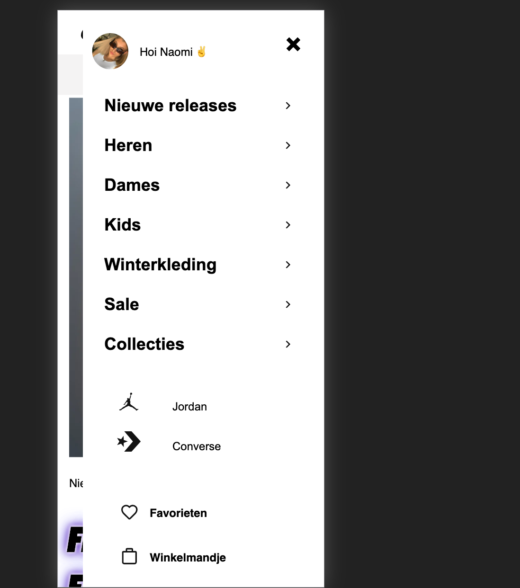

# Procesverslag
**Auteur:** Naomi Hendricks

Markdown cheat cheet: [Hulp bij het schrijven van Markdown](https://github.com/adam-p/markdown-here/wiki/Markdown-Cheatsheet). Nb. de standaardstructuur en de spartaanse opmaak zijn helemaal prima. Het gaat om de inhoud van je procesverslag. Besteedt de tijd voor pracht en praal aan je website.

## Bronnenlijst
1. Swoosh logo en verder alle svg's op de website: https://www.nike.com/nl/
2. alle afbeeldingen: https://www.nike.com/nl/
3. Iconen: https://fontawesome.com/
4. Sidebar: https://www.w3schools.com/howto/tryit.asp?filename=tryhow_js_sidenav 
5. fonts: https://fontsempire.com/font/nike-font/, https://www.ffonts.net/US-101.font.download
6. Glowing text "Find your fast: bron:https://www.w3schools.com/howto/howto_css_glowing_text.asp

## Eindgesprek (week 7/8)
Aan het begin vond ik het best moeilijk om motivatie te vinden wat betreft coderen, gedurend door de afgelopen weken heen ben ik me gaan realiseren dat ik het toch wel leuk en uitdagend vind om te doen. Het is voor mijn eigen ontwikkeling zeker nodig geweest en merk ik wel voortgang te hebben geboekt. Namens dankzij de uitgebreide lesstof en oefeningen die we hebben besproken heb ik deze kennis meegenomen naar mijn eigen website en ben ik eindstand best trots op mezelf. Wel vind ik dat ik wellicht beter moet kunnen selecteren vanuit CSS gezien ik achteraf merk dat ik toch wel wat classes heb gebruikt dus dat kan ik in de toekomst zeker aanscherpen zodat het ook wat overzichtelijker wordt voor zowel mezelf als anderen. Vandaar dat ik veel comments in mijn sheets heb staan zodat dit wat duidelijker overeenkomt zodra een ander mijn bestand opent. 
Verder heb ik nog wat kleine animaties toegevoegd wat ik erg leuk vond om te doen en ben ik tevreden met mijn opzet. 

**Screenshot(s):**

## Voortgang 3 (week 6)

Ik begin het steeds leuker te vinden om te coderen, ik begrijp bepaalde stof beter en is de motivatie helemaal terug, in de vakantie en deze huidige week ga ik mij voornamelijk focussen op de content. Eerst wil ik geheel twee pagina's afhebben, daarna met javascript aan de slag gaan en de focus leggen op het surface gedeelte.
Zodra dat allemaal af is, wil ik mijn code na gaan op fouten/kijken of ik het netter of eventueel kan inkorten. 

## Voortgang 2 (week 5)
Hierbij gedeelte HTML en CSS, met voortgang shots.

## Voortgang 1 (week 3)
Hierbij een gedeelte code, ik heb een svg gebruikt ipv een svg wel merk ik dat dit veel ruimte in neemt binnen mijn html bestand.

### Stand van zaken
Ik merk dat ik er steeds meer in kom, ik probeer zoveel mogelijk oefeningen te maken en kijk ik daarnaast nog naar bepaalde tutorials en vraag ik mede studenten om hulp. Ik ga mij de komende dagen voornamelijk focussen op dit vak gezien ik dit een goede uitdaging vind en dit graag wil halen met een website waar ik uiteindelijk trots op kan zijn. Ik merk dat ik nu vastloop met het positioneren van teksten onder een img. Ik heb een Ul met een Li aangemaakt met bepaalde items en vervolgens de afbeeldingen als achtergrond neergezet in css. Ik krijg het niet voor elkaar om de tekst onder deze boxes te krijgen.. 

**Screenshot(s):**

### Agenda voor meeting
Naomi: voorbeelden van states 
Tim: voorbeelden van states
Saphia:  afbeeldingen na h1, javascript
Joris: naar code kijken effectief? +-10 min. 
Martine: naar code laten kijken

### Verslag van meeting
Tijdens de meeting hebben wij ieder onze vragen kunnen stellen, hier is goed op geantwoord en waren de student assistente's erg behulpzaam. 
Verder hebben wij niet veel vragen gesteld gezien iedereen niet helemaal klaar was met de eerste pagina. 
Uiteindelijk hebben we te horen gekregen dat wij voor de volgende keer als tip goed moeten bedenken welke onderwerpen wij willen bespreken met elkaar gezien het nu wat spontaan verliep. Dit is een aankaart punt voor ons en gaan wij dit de volgende keer toepassen. 

## Intake (week 1)

**Je startniveau:** Blauw

**Je focus:** Surface plane

**Je opdracht:** https://www.nike.com/nl/

**Screenshot(s):**

**Breakdown-schets(en):**

![-voorlopige breakdownschets(en) van een of beide pagina's van de site die je gaat maken-]

